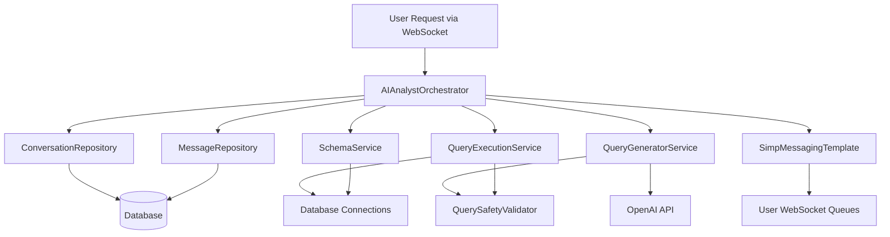
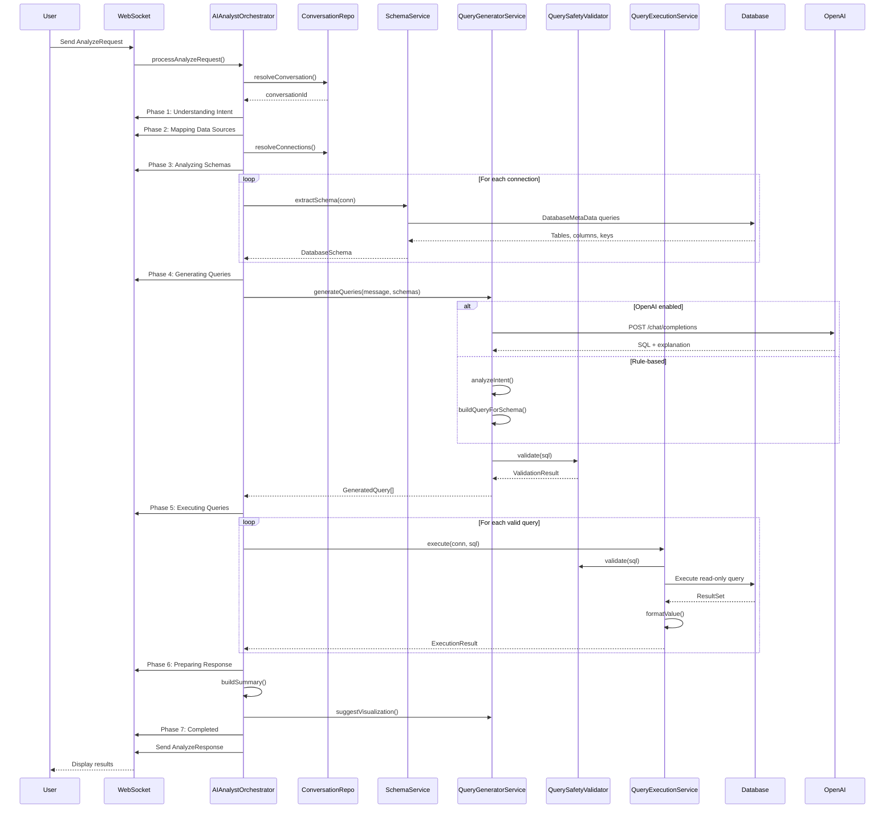

# AIAnalystOrchestrator - Complete Architecture Analysis

## Executive Summary

The `AIAnalystOrchestrator` is the core service orchestrating AI-powered database query analysis through a 7-phase pipeline. It coordinates between schema extraction, query generation (with optional OpenAI integration), query execution, and real-time WebSocket progress updates to users.

---

## Architecture Overview



---

## Core Orchestrator: AIAnalystOrchestrator

### Class Declaration
```java
@Service
@RequiredArgsConstructor
@Slf4j
public class AIAnalystOrchestrator
```

### Dependencies (Injected via Constructor)
1. **`SimpMessagingTemplate messagingTemplate`** - WebSocket messaging for real-time updates
2. **`DatabaseConnectionRepository connectionRepository`** - Fetches user's DB connections
3. **`ConversationRepository conversationRepository`** - Manages conversation persistence
4. **`MessageRepository messageRepository`** - Stores messages and activities
5. **`SchemaService schemaService`** - Extracts database schema metadata
6. **`QueryGeneratorService queryGeneratorService`** - Generates SQL from natural language
7. **`QueryExecutionService queryExecutionService`** - Executes queries safely

---

## Method-by-Method Analysis

### 1. `processAnalyzeRequest(AnalyzeRequest request, User user, String wsUser)`

**Purpose:** Main orchestration method handling the entire 7-phase analysis pipeline

**Phases:**

#### Phase 0: Initialization (Lines 34-41)
- Resolves or creates conversation
- Stores user message
- Sends initial message acknowledgment

#### Phase 1: Understanding Intent (Lines 46-50)
```java
storeActivity(conversationId, wsUser, AIActivityPhase.UNDERSTANDING_INTENT,
    "in_progress", "Analyzing your request: \"" + truncate(request.getUserMessage(), 100) + "\"", "ACTIVITY", message.getId());
```
- **Action:** Analyzes user's natural language request
- **WebSocket:** Sends "understanding_intent" activity
- **Storage:** Creates activity record

#### Phase 2: Mapping Data Sources (Lines 53-67)
```java
List<DatabaseConnection> connections = resolveConnections(request.getConnectionIds(), user);
```
- **Action:** Validates and retrieves database connections
- **Error Handling:** Returns `NO_CONNECTIONS` error if none found
- **WebSocket:** Reports number of connections found

#### Phase 3: Analyzing Schemas (Lines 70-96)
```java
SchemaService.DatabaseSchema schema = schemaService.extractSchema(conn);
schemas.put(conn.getId(), schema);
```
- **Action:** Extracts table/column metadata from each database
- **Error Handling:** Logs failures but continues with other connections
- **Partial Success:** Continues if at least one schema loads
- **WebSocket:** Reports tables found per connection

#### Phase 4: Generating Queries (Lines 99-130)
```java
QueryGeneratorService.QueryGenerationResult generationResult =
    queryGeneratorService.generateQueries(request.getUserMessage(), schemas, true);
```
- **Action:** Generates SQL queries (rule-based or OpenAI)
- **Validation:** Filters valid queries using `QuerySafetyValidator`
- **Error Handling:** Returns `QUERY_GENERATION_FAILED` if no valid queries
- **WebSocket:** Shows generated SQL for each connection

#### Phase 5: Executing Queries (Lines 133-171)
```java
QueryExecutionService.ExecutionResult result = queryExecutionService.execute(conn, genQuery.getSql());
```
- **Action:** Executes validated queries against databases
- **Safety:** Double-validated by `QuerySafetyValidator`
- **Collects:** Data, columns, row counts, execution times
- **WebSocket:** Reports execution results and timing

#### Phase 6: Preparing Response (Lines 174-184)
```java
String summary = buildSummary(request.getUserMessage(), queryResults);
String visualization = queryGeneratorService.suggestVisualization(detectedIntent, allData);
```
- **Action:** Builds summary and suggests visualization
- **Visualization Types:** kpi_card, bar_chart, pie_chart, line_chart, table

#### Phase 7: Completed (Lines 190-202)
```java
AnalyzeResponse response = AnalyzeResponse.success(conversationId, summary, queryResults, visualization);
```
- **Action:** Sends final response to user
- **WebSocket Queues:**
  - `/queue/ai/response` - Final structured response
  - `/queue/ai/activity` - Completion activity

**Error Handling (Lines 204-209):**
```java
catch (Exception e) {
    sendErrorResponse(conversationId, user, "INTERNAL_ERROR", ...);
}
```

---

### 2. `storeActivity(Long conversationId, String wsUser, AIActivityPhase phase, String status, String content, String type, Long messageId)`

**Purpose:** Persists activity and sends WebSocket notification

**Flow:**
1. Creates `Activities` entity with content and metadata
2. Saves to database via `messageRepository.saveActivity()`
3. Converts to JSON
4. Sends to `/queue/ai/message` via `sendActivity()`

**Activity Types:**
- `"ACTIVITY"` - Progress updates
- `"RESPONSE"` - Final answer payload

---

### 3. `resolveConversation(AnalyzeRequest request, User user)` → `Long`

**Purpose:** Gets existing conversation or creates new one

**Logic:**
```java
if (request.getConversationId() != null) {
    Conversation existing = conversationRepository.findByIdAndUserId(...);
    if (existing != null) return existing.getId();
}
// Create new conversation
```

**Fields Set:**
- **name:** `"AI Analysis - " + truncate(userMessage, 50)`
- **connectionIds:** Comma-separated connection IDs
- **user:** User ID
- **shared:** false

**Security:** User isolation via `findByIdAndUserId()`

---

### 4. `storeUserMessage(Long conversationId, String content)` → `Message`

**Purpose:** Persists user's question

**Fields:**
```java
Message.builder()
    .content(content)
    .sentByUser(true)
    .conversation(conversationId)
    .build()
```

---

### 5. `storeAIResponse(Long conversationId, String content)` → `Message`

**Purpose:** Persists AI's answer

**Fields:**
```java
Message.builder()
    .content(content)
    .sentByUser(false)
    .conversation(conversationId)
    .build()
```

---

### 6. `resolveConnections(List<Long> connectionIds, User user)` → `List<DatabaseConnection>`

**Purpose:** Fetches valid connections for user

**Security:**
```java
DatabaseConnection conn = connectionRepository.findByIdAndUserId(connId, user.getId());
```
- Ensures user can only access their own connections
- Logs warnings for invalid connection IDs
- Returns empty list if no valid connections

---

### 7. `buildSummary(String userMessage, List<AnalyzeResponse.QueryResult> results)` → `String`

**Purpose:** Generates human-readable summary of results

**Logic:**
- If no results: "No data was returned..."
- For each result: Connection name + row count
- **Special case:** Single row with ≤3 columns shows actual values
- **Multi-source:** Adds note about multiple data sources

**Example Output:**
```
Results for your query: "show users"

From Production DB: 142 row(s) returned
From Analytics DB: 89 row(s) returned

Data was queried from 2 separate data sources and presented independently.
```

---

### 8. `sendActivity(Long conversationId, String user, AIActivityPhase phase, String status, String message)`

**Purpose:** Sends activity update via WebSocket

**Destination:** `/queue/ai/activity`

**Payload:**
```java
AIActivityMessage.of(phase.getCode(), status, message, conversationId)
```

---

### 9. `sendMessage(Long conversationId, String user, AIActivityPhase phase, String status, String message)`

**Purpose:** Sends message update via WebSocket

**Destination:** `/queue/ai/message`

**Difference from `sendActivity`:** Uses different WebSocket queue for message-specific events

---

### 10. `sendErrorResponse(Long conversationId, User user, String code, String message, String suggestion, String wsUser)`

**Purpose:** Handles error notifications

**Error Codes:**
- `NO_CONNECTIONS` - No valid database connections
- `SCHEMA_ERROR` - Schema extraction failed
- `QUERY_GENERATION_FAILED` - Cannot generate valid SQL
- `INTERNAL_ERROR` - Unexpected exception

**Sends to 3 destinations:**
1. `/queue/ai/activity` - Activity with error status
2. `/queue/ai/response` - Error response
3. `/queue/ai/error` - Dedicated error queue

---

### 11. `truncate(String text, int maxLength)` → `String`

**Purpose:** Truncates text for display

**Logic:**
```java
return text.length() <= maxLength ? text : text.substring(0, maxLength) + "..."
```

---

## Connected Classes Analysis

### DTOs (Data Transfer Objects)

#### [AnalyzeRequest](file:///Users/kalaimaran.m/Documents/DataNexus/data-nexus/src/main/java/com/datanexus/datanexus/dto/websocket/AnalyzeRequest.java)
```java
public class AnalyzeRequest {
    private String userMessage;       // Natural language query
    private Long conversationId;      // Optional: existing conversation
    private List<Long> connectionIds; // Database connections to query
}
```

#### [AnalyzeResponse](file:///Users/kalaimaran.m/Documents/DataNexus/data-nexus/src/main/java/com/datanexus/datanexus/dto/websocket/AnalyzeResponse.java)
```java
public class AnalyzeResponse {
    private boolean success;
    private Long conversationId;
    private String summary;                      // Human-readable summary
    private List<QueryResult> queryResults;      // Data from each connection
    private String suggestedVisualization;       // kpi_card, bar_chart, etc.
    private ErrorInfo error;
    private Instant timestamp;
    
    // Nested classes
    static class QueryResult {
        private Long connectionId;
        private String connectionName;
        private String query;                    // Executed SQL
        private List<Map<String, Object>> data;  // Result rows
        private List<String> columns;
        private int rowCount;
    }
    
    static class ErrorInfo {
        private String code;
        private String message;
        private String suggestion;
    }
    
    // Factory methods
    static AnalyzeResponse success(...);
    static AnalyzeResponse error(...);
}
```

#### [AIActivityMessage](file:///Users/kalaimaran.m/Documents/DataNexus/data-nexus/src/main/java/com/datanexus/datanexus/dto/websocket/AIActivityMessage.java)
```java
public class AIActivityMessage {
    private String phase;              // Phase code (e.g., "understanding_intent")
    private String status;             // "in_progress", "completed", "error"
    private String message;            // Human-readable message
    private Long conversationId;
    private Instant timestamp;
    
    static AIActivityMessage of(String phase, String status, String message, Long conversationId);
}
```

---

### Entities

#### [Conversation](file:///Users/kalaimaran.m/Documents/DataNexus/data-nexus/src/main/java/com/datanexus/datanexus/entity/Conversation.java)
```java
@Entity
@Table(name = "conversations")
public class Conversation {
    @Id @GeneratedValue
    private Long id;
    
    private String name;                    // Display name
    private String connectionIds;           // CSV of connection IDs
    private Long user;                      // Owner user ID
    private boolean shared;
    private String shareId;
    
    @CreationTimestamp
    private Instant createdAt;
    @UpdateTimestamp
    private Instant updatedAt;
}
```

#### [Message](file:///Users/kalaimaran.m/Documents/DataNexus/data-nexus/src/main/java/com/datanexus/datanexus/entity/Message.java)
```java
@Entity
@Table(name = "messages")
public class Message {
    @Id @GeneratedValue
    private Long id;
    
    @Column(columnDefinition = "TEXT")
    private String content;                 // Message text
    
    @Column(columnDefinition = "TEXT")
    private String rawMessage;              // Original unprocessed message
    
    private String connectionIds;
    private boolean sentByUser;             // true = user, false = AI
    private Long conversation;
    
    @CreationTimestamp
    private Instant createdAt;
    @UpdateTimestamp
    private Instant updatedAt;
}
```

#### [Activities](file:///Users/kalaimaran.m/Documents/DataNexus/data-nexus/src/main/java/com/datanexus/datanexus/entity/Activities.java)
```java
@Entity
@Table(name = "activity")
public class Activities {
    @Id @GeneratedValue
    private Long id;
    
    @Column(columnDefinition = "TEXT")
    private String content;                 // Activity content (JSON or text)
    
    private String type;                    // "ACTIVITY" or "RESPONSE"
    private Long messageId;                 // Parent message
    private Long conversation;
    
    @CreationTimestamp
    private Instant createdAt;
    @UpdateTimestamp
    private Instant updatedAt;
}
```

#### [DatabaseConnection](file:///Users/kalaimaran.m/Documents/DataNexus/data-nexus/src/main/java/com/datanexus/datanexus/entity/DatabaseConnection.java)
```java
@Entity
@Table(name = "database_connections")
public class DatabaseConnection {
    @Id @GeneratedValue
    private Long id;
    
    private String name;                    // Display name
    private String type;                    // "postgresql", "mysql"
    private String typeName;
    private String typeIcon;
    
    private String host;
    private String port;
    private String database;
    private String username;
    private String password;                // TODO: Should be encrypted!
    private String status;
    private Long user;
    private String otherDetails;
    
    @CreationTimestamp
    private Instant createdAt;
    @UpdateTimestamp
    private Instant updatedAt;
    
    private Instant lastUsed;
}
```

> [!WARNING]
> **Security Issue:** Passwords are stored as plain text. Consider encryption or secret management.

---

### Repositories

All repositories use a custom `PSQLUtil` for database operations.

#### [ConversationRepository](file:///Users/kalaimaran.m/Documents/DataNexus/data-nexus/src/main/java/com/datanexus/datanexus/repository/ConversationRepository.java)
**Methods:**
- `findByUserIdOrdered(Long userId, String orderDir, int limit, int offset)` - Paginated query
- `countByUserId(Long userId)` - Total count for user
- `findByIdAndUserId(Long id, Long userId)` - **Security:** User-scoped fetch
- `findByShareId(String shareId)` - Public shared conversations
- `save(Conversation)` - Persist/update
- `delete(Conversation)` - Remove

#### [MessageRepository](file:///Users/kalaimaran.m/Documents/DataNexus/data-nexus/src/main/java/com/datanexus/datanexus/repository/MessageRepository.java)
**Methods:**
- `save(Message)` - Persist message
- `findByConversationId(Long)` - Get all messages in conversation
- `countByConversationId(Long)` - Message count
- `saveActivity(Activities)` - Persist activity
- `findActivityByConversation(Long)` - Get all activities

#### [DatabaseConnectionRepository](file:///Users/kalaimaran.m/Documents/DataNexus/data-nexus/src/main/java/com/datanexus/datanexus/repository/DatabaseConnectionRepository.java)
**Methods:**
- `findByUserIdOrderByLastUsedDesc(Long userId)` - Recent connections
- `findByIdAndUserId(Long id, Long userId)` - **Security:** User-scoped fetch
- `save(DatabaseConnection)` - Persist
- `delete(DatabaseConnection)` - Remove

---

### Services

#### [SchemaService](file:///Users/kalaimaran.m/Documents/DataNexus/data-nexus/src/main/java/com/datanexus/datanexus/service/ai/SchemaService.java)

**Purpose:** Extracts database schema metadata

**Inner Classes:**
```java
class TableSchema {
    String tableName;
    List<ColumnSchema> columns;
    List<String> primaryKeys;
}

class ColumnSchema {
    String name;
    String dataType;
    boolean nullable;
    boolean primaryKey;
}

class DatabaseSchema {
    Long connectionId;
    String connectionName;
    String databaseType;
    List<TableSchema> tables;
}
```

**Key Methods:**

##### `extractSchema(DatabaseConnection conn)` → `DatabaseSchema`
**Process:**
1. Builds JDBC URL from connection details
2. Connects to database
3. Uses `DatabaseMetaData` to get tables
4. Filters system tables (`pg_*`, `mysql.*`, etc.)
5. Extracts primary keys
6. Extracts column metadata
7. Returns structured schema

**Supports:** PostgreSQL, MySQL (extensible)

##### `schemaToDescription(DatabaseSchema schema)` → `String`
**Converts schema to human-readable text:**
```
Database: Production DB (postgresql)
Tables:
  - users (id INTEGER PK NOT NULL, email VARCHAR, created_at TIMESTAMP)
  - orders (id INTEGER PK NOT NULL, user_id INTEGER, total DECIMAL)
```

**Private Helpers:**
- `getDefaultSchema(String dbType)` - Returns default schema name
- `isSystemTable(String tableName, String dbType)` - Filters internal tables
- `buildJdbcUrl(...)` - Constructs JDBC connection string

---

#### [QueryGeneratorService](file:///Users/kalaimaran.m/Documents/DataNexus/data-nexus/src/main/java/com/datanexus/datanexus/service/ai/QueryGeneratorService.java)

**Purpose:** Generates SQL queries from natural language

**Configuration:**
```java
@Value("${ai.openai.api-key:}")
private String openAiApiKey;

@Value("${ai.openai.model:gpt-4o-mini}")
private String openAiModel;

@Value("${ai.openai.url:https://api.openai.com/v1/chat/completions}")
private String openAiUrl;
```

**Inner Classes:**
```java
class GeneratedQuery {
    Long connectionId;
    String sql;
    String explanation;
    boolean valid;
    String validationError;
}

class QueryGenerationResult {
    String intent;                    // Detected intent type
    List<GeneratedQuery> queries;
}
```

**Key Methods:**

##### `generateQueries(String userMessage, Map<Long, DatabaseSchema> schemas, boolean isAskOpenAi)` → `QueryGenerationResult`

**Dual Mode:**
1. **OpenAI mode** (if API key configured and `isAskOpenAi=true`):
   - Calls `generateQueriesWithOpenAi()`
   - Uses GPT model for query generation
   
2. **Rule-based mode** (fallback):
   - Analyzes intent locally
   - Builds query from detected pattern

##### `analyzeIntent(String userMessage)` → `String`

**Intent Detection (Keyword-based):**

| Intent | Keywords | Example |
|--------|----------|---------|
| COUNT | "count", "how many", "total number" | "How many users?" |
| AVERAGE | "average", "avg", "mean" | "Average order value" |
| SUM | "sum", "total", "combined" | "Total sales" |
| MAX | "max", "maximum", "highest", "top" | "Top 10 products" |
| MIN | "min", "minimum", "lowest" | "Lowest price" |
| GROUP | "group by", "per", "breakdown" | "Sales per category" |
| TREND | "trend", "over time", "timeline" | "Sales over time" |
| COMPARE | "compare", "difference", "vs" | "Compare regions" |
| LIST | "list", "show", "display", "get" | "Show all users" |

**Default:** `LIST`

##### `buildQueryForSchema(...)` → `GeneratedQuery`

**Process:**
1. Find relevant tables (matches table name in user message)
2. Find relevant columns (matches column names)
3. Build SQL based on intent
4. Validate with `QuerySafetyValidator`
5. Return validated query

##### Intent-Specific Query Builders:

**`buildCountQuery()`:**
```sql
-- With grouping
SELECT t.category, COUNT(*) AS count 
FROM products t 
GROUP BY t.category 
ORDER BY count DESC 
LIMIT 100

-- Simple count
SELECT COUNT(*) AS total_count FROM products t
```

**`buildAggregateQuery(function, ...)`:**
```sql
SELECT AVG(t.price) AS avg_price FROM products t
```

**`buildGroupQuery()`:**
```sql
SELECT t.category, SUM(t.sales) AS total, AVG(t.sales) AS average 
FROM products t 
GROUP BY t.category 
ORDER BY total DESC 
LIMIT 100
```

**`buildTrendQuery()`:**
```sql
SELECT t.created_at, SUM(t.amount) AS total 
FROM orders t 
GROUP BY t.created_at 
ORDER BY t.created_at ASC 
LIMIT 100
```

**`buildListQuery()`:**
```sql
SELECT t.id, t.name, t.email FROM users t LIMIT 100
```

**Safety Features:**
- Always includes `LIMIT 100` for list queries
- Validates all queries with `QuerySafetyValidator`
- Quotes identifiers for special characters

##### `generateQueriesWithOpenAi(...)` → `QueryGenerationResult`

**OpenAI Integration:**

**Prompt Template:**
```
User request: {userMessage}

Database schema:
{schemaDescription}

Generate exactly one read-only SQL query for this database.
Rules: only SELECT/WITH, no DDL/DML, include LIMIT 100 when listing rows.
Return JSON only in this format:
{"sql":"...","intent":"...","explanation":"..."}
```

**System Prompt:**
```
You are a SQL assistant. Output strict JSON only.
```

**Configuration:**
- Temperature: 0 (deterministic)
- Timeout: 40 seconds
- Model: Configurable (default: gpt-4o-mini)

**Response Parsing:**
```java
JsonNode queryJson = objectMapper.readTree(stripCodeFences(content));
String sql = queryJson.path("sql").asText("").trim();
String intent = queryJson.path("intent").asText(analyzeIntent(userMessage));
```

**Error Handling:**
- HTTP errors → Returns invalid query with error message
- Empty response → Returns validation error
- Safety validation failure → Blocks query execution

##### `suggestVisualization(String intent, List<Map<String, Object>> data)` → `String`

**Visualization Suggestions:**

| Intent | Single Row | Multiple Rows |
|--------|-----------|---------------|
| COUNT | kpi_card | bar_chart |
| AVERAGE/SUM/MAX/MIN | kpi_card | bar_chart |
| GROUP | - | pie_chart (≤6 rows), bar_chart (>6) |
| TREND | - | line_chart |
| COMPARE | - | bar_chart |
| LIST/Default | - | table |

---

#### [QueryExecutionService](file:///Users/kalaimaran.m/Documents/DataNexus/data-nexus/src/main/java/com/datanexus/datanexus/service/ai/QueryExecutionService.java)

**Purpose:** Safely executes SQL queries

**Inner Class:**
```java
class ExecutionResult {
    boolean success;
    List<Map<String, Object>> data;
    List<String> columns;
    int rowCount;
    long executionTimeMs;
    String errorMessage;
}
```

##### `execute(DatabaseConnection conn, String sql)` → `ExecutionResult`

#### Security Measures:
1. **Pre-execution validation** with `QuerySafetyValidator`
2. **Read-only connection:**
   ```java
   dbConn.setReadOnly(true);
   dbConn.setAutoCommit(false);
   ```
3. **Query timeout:** 30 seconds
4. **Post-execution rollback:** Ensures no mutations

**Data Processing:**
- Extracts columns from `ResultSetMetaData`
- Formats special types (timestamps, dates, binary)
- Returns structured `Map<String, Object>` rows

**Error Handling:**
- Sanitizes error messages (removes passwords, URLs)
- Logs execution failures
- Returns sanitized error to user

##### `formatValue(Object value)` → `Object`

**Type Conversions:**
```java
Timestamp → Instant.toString()
Date → String
Time → String
byte[] → "[binary data]"
```

##### `sanitizeErrorMessage(String message)` → `String`

**Security:**
```java
message
    .replaceAll("password=\\S+", "password=***")
    .replaceAll("jdbc:[^\\s]+", "[connection-url]")
```

---

#### [QuerySafetyValidator](file:///Users/kalaimaran.m/Documents/DataNexus/data-nexus/src/main/java/com/datanexus/datanexus/service/ai/QuerySafetyValidator.java)

**Purpose:** Ensures only safe read-only queries execute

**Dependencies:**
- `net.sf.jsqlparser` - SQL parsing library for AST-based validation

**Inner Class:**
```java
class ValidationResult {
    boolean valid;
    String reason;
    
    static ValidationResult valid();
    static ValidationResult invalid(String reason);
}
```

##### `validate(String sql)` → `ValidationResult`

**Multi-Layer Validation:**

**Layer 1: Pattern Matching (Blacklist)**

Forbidden SQL keywords (case-insensitive):
```java
INSERT, UPDATE, DELETE, DROP, ALTER, CREATE, TRUNCATE, 
GRANT, REVOKE, EXEC(UTE), CALL, MERGE, REPLACE
```

**Regex Patterns:**
```java
Pattern.compile("\\bINSERT\\b", Pattern.CASE_INSENSITIVE)
// Uses word boundaries to prevent false positives like "INSERTED_AT"
```

**Layer 2: SQL Parser Validation**

```java
Statement statement = CCJSqlParserUtil.parse(trimmed);
if (!(statement instanceof Select)) {
    return ValidationResult.invalid("Only SELECT statements are allowed");
}
```

**Fallback:** If parsing fails, checks if query starts with `SELECT` or `WITH`

**Preprocessing:**
- Trims whitespace
- Removes trailing semicolon
- Null/blank checks

**Security Considerations:**

> [!CAUTION]
> **Potential Bypass:**
> - Pattern matching can miss obfuscated SQL (e.g., comments, Unicode)
> - Parser fallback is weaker than AST validation
> - No protection against expensive queries (e.g., cartesian products)

**Improvement Suggestions:**
1. Add query complexity limits (table joins, subquery depth)
2. Implement query cost estimation
3. Add timeout enforcement at validator level
4. Block UNION with non-SELECT statements

---

#### [User](file:///Users/kalaimaran.m/Documents/DataNexus/data-nexus/src/main/java/com/datanexus/datanexus/entity/User.java)
```java
@Entity
@Table(name = "users")
public class User {
    @Id @GeneratedValue
    private Long id;
    
    @Column(unique = true, nullable = false)
    private String username;
    
    @Column(unique = true, nullable = false)
    private String email;
    
    @Column(nullable = false)
    private String password;                // TODO: Should be hashed!
    
    @CreationTimestamp
    private Instant createdAt;
    @UpdateTimestamp
    private Instant updatedAt;
    
    private Instant lastLogin;
}
```

> [!WARNING]
> **Security Issue:** Password should be hashed with BCrypt/Argon2, not stored as plain text.

---

### Enums

#### [AIActivityPhase](file:///Users/kalaimaran.m/Documents/DataNexus/data-nexus/src/main/java/com/datanexus/datanexus/service/ai/AIActivityPhase.java)
```java
public enum AIActivityPhase {
    UNDERSTANDING_INTENT("understanding_intent", "Understanding user intent"),
    MAPPING_DATA_SOURCES("mapping_data_sources", "Mapping intent to data sources"),
    ANALYZING_SCHEMAS("analyzing_schemas", "Analyzing schemas"),
    GENERATING_QUERIES("generating_queries", "Generating safe SELECT queries"),
    EXECUTING_QUERIES("executing_queries", "Executing queries"),
    PREPARING_RESPONSE("preparing_response", "Preparing response"),
    COMPLETED("completed", "Final answer"),
    ERROR("error", "Error occurred");
    
    private final String code;          // WebSocket phase identifier
    private final String description;   // Human-readable description
}
```

---

## Data Flow Diagram



---

## Potential Improvement Areas for Revamp

### 1. Architecture & Design

> [!IMPORTANT]
> **Separation of Concerns**
> - Current: Monolithic orchestrator with 363 lines
> - Suggested: Extract pipeline stages into separate services
>   ```java
>   IntentAnalyzer
>   DataSourceMapper
>   SchemaAnalyzer
>   QueryPipeline
>   ResponseBuilder
>   ```

> [!TIP]
> **Strategy Pattern for Query Generation**
> - Create `QueryGenerationStrategy` interface
> - Implementations: `RuleBasedStrategy`, `OpenAIStrategy`, `HybridStrategy`
> - Easy to add new AI providers (Claude, Gemini, etc.)

### 2. Performance

- **Schema Caching:** Cache schemas per connection to avoid repeated extraction
  ```java
  @Cacheable(key = "#conn.id")
  DatabaseSchema extractSchema(DatabaseConnection conn)
  ```

- **Parallel Execution:** Execute queries against multiple connections in parallel
  ```java
  CompletableFuture.allOf(futures).join()
  ```

- **Connection Pooling:** Reuse database connections instead of creating new ones

### 3. Security

> [!CAUTION]
> **Critical Security Issues:**
> 1. **Plaintext Passwords** in `DatabaseConnection` entity
>    - Implement encryption at rest
>    - Use Spring Security Crypto or external vault
> 
> 2. **SQL Injection Risk** in custom `PSQLUtil`
>    - Ensure all queries use parameterized statements
> 
> 3. **User Authorization** 
>    - Add role-based access control (RBAC)
>    - Audit logging for all database queries

### 4. Reliability

- **Transactional Consistency:** Add `@Transactional` to methods persisting multiple entities
- **Retry Logic:** Retry failed schema extractions and queries
- **Circuit Breaker:** Prevent cascading failures to OpenAI API
- **Rate Limiting:** Prevent OpenAI API quota exhaustion

### 5. Observability

- **Metrics:** Track query execution times, success rates, intent distribution
  ```java
  @Timed("ai.orchestrator.processRequest")
  @Counted("ai.orchestrator.errors", condition = "#result.success == false")
  ```

- **Distributed Tracing:** Add OpenTelemetry spans for each phase
- **Structured Logging:** Use MDC for correlation IDs

### 6. Testing

- **Unit Tests:** Mock dependencies and test each method independently
- **Integration Tests:** Test full pipeline with test databases
- **Contract Tests:** Verify OpenAI API response handling
- **Load Tests:** Simulate concurrent user requests

### 7. Data Model

**Issues:**
- `connectionIds` stored as CSV string (should be `@OneToMany` relationship)
- `Activities.type` is a string (should be enum)
- `DatabaseConnection.status` unclear meaning

**Suggested Schema:**
```java
@Entity
class ConversationConnection {
    @ManyToOne Conversation conversation;
    @ManyToOne DatabaseConnection connection;
}

enum ActivityType { ACTIVITY, RESPONSE }
enum ConnectionStatus { ACTIVE, INACTIVE, ERROR }
```

### 8. WebSocket Communication

- **Acknowledgments:** Ensure message delivery with acks
- **Compression:** Enable WebSocket compression for large payloads
- **Reconnection:** Handle client disconnections gracefully

### 9. Query Generation

- **Hybrid Approach:** Use rules for simple queries, AI for complex ones
- **Query Optimization:** Analyze and optimize generated SQL
- **Multi-table Joins:** Support queries spanning multiple tables
- **Subqueries & CTEs:** Generate more complex SQL patterns

### 10. Visualization

- **Smart Suggestions:** Use data shape analysis (not just intent)
  ```java
  // Consider: column types, cardinality, distributions
  if (hasDateColumn && hasNumericColumn) return "line_chart";
  if (categoricalColumn.cardinality <= 6) return "pie_chart";
  ```

- **Custom Visualizations:** Allow users to override suggestions
- **Chart Configuration:** Return chart-specific configs (axis labels, colors)

---

## Technology Stack

### Frameworks & Libraries
- **Spring Boot** - Dependency injection, configuration
- **Spring WebSocket** - Real-time communication
- **Spring Data JPA** - Persistence (via custom `PSQLUtil`)
- **Lombok** - Boilerplate reduction
- **Jackson** - JSON serialization
- **SLF4J** - Logging

### External Dependencies
- **OpenAI API** - Optional AI-powered query generation
- **JDBC Drivers** - PostgreSQL, MySQL

### Database
- Uses custom `PSQLUtil` instead of Spring Data repositories
- Supports PostgreSQL and MySQL connections

---

## Testing Considerations

### Current State
*No test files found in the analysis scope*

### Recommended Test Structure

```
src/test/java/com/datanexus/datanexus/service/ai/
├── AIAnalystOrchestratorTest.java
├── SchemaServiceTest.java
├── QueryGeneratorServiceTest.java
├── QueryExecutionServiceTest.java
├── QuerySafetyValidatorTest.java
└── integration/
    ├── EndToEndAnalysisTest.java
    ├── OpenAIIntegrationTest.java
    └── MultiDatabaseTest.java
```

### Test Scenarios

**Unit Tests:**
- Intent detection accuracy
- Query generation for each intent type
- Schema extraction edge cases
- Error handling paths
- Summary building logic

**Integration Tests:**
- Full pipeline with test PostgreSQL/MySQL databases
- OpenAI mock server
- WebSocket message verification
- Multi-connection queries

**Performance Tests:**
- Large schema handling (1000+ tables)
- Query execution timeouts
- Concurrent user requests

---

## Configuration Properties

```yaml
ai:
  openai:
    api-key: ${OPENAI_API_KEY:}
    model: gpt-4o-mini
    url: https://api.openai.com/v1/chat/completions
```

---

## Next Steps for Revamp

1. **Define Requirements:** What are the pain points? What new features?
2. **Architecture Decision:** Modular services vs. monolith refinement
3. **Data Model Migration:** Plan schema changes for relationships
4. **Security Hardening:** Implement encryption and RBAC
5. **Testing Strategy:** Set up test infrastructure
6. **Performance Baseline:** Measure current performance
7. **Incremental Refactoring:** Refactor in stages, not big bang

