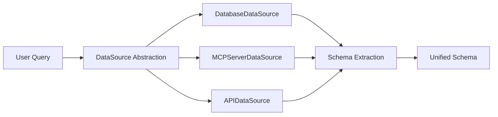
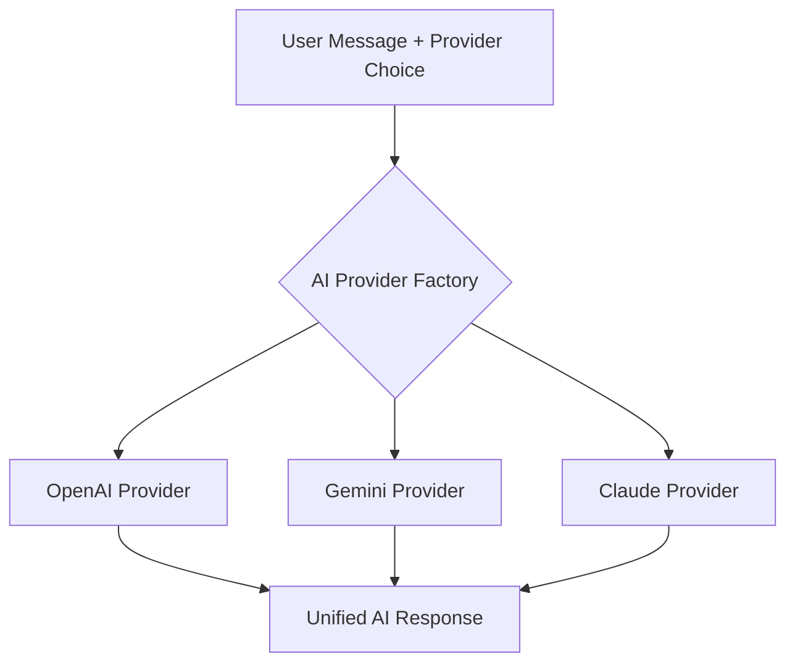
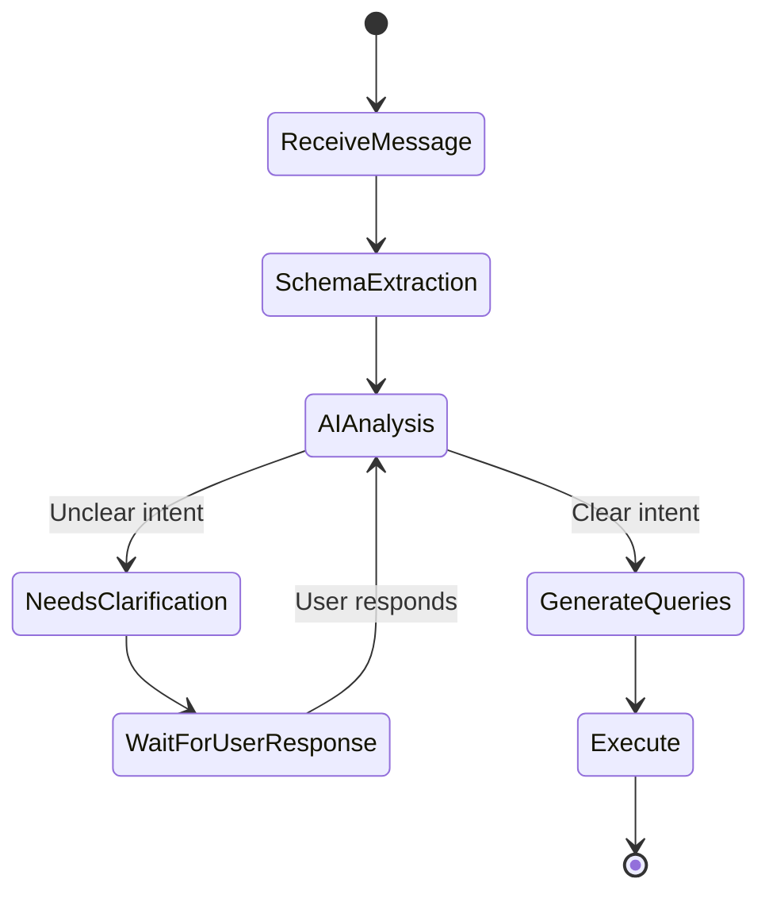
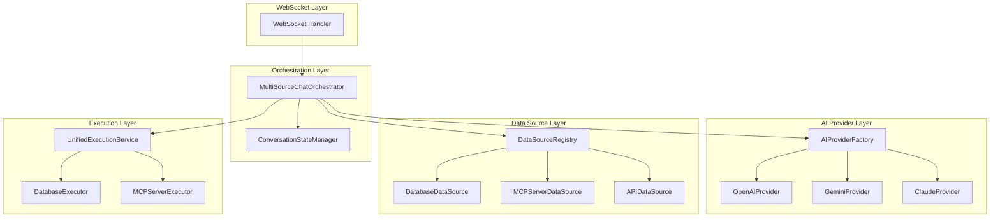

# Multi-Source AI Chat Architecture - Implementation Plan

## Overview

Transform the current single-purpose AI analyst into a **multi-source conversational AI dashboard** that:
- Supports databases, MCP servers, and other data sources
- Integrates multiple AI providers (Gemini, Claude, OpenAI)
- Enables conversational clarification flow
- Maintains WebSocket-based real-time communication

---

## Current vs. New Architecture

### Current Flow
```
User Message → Schema Extraction → Query Generation → Query Execution → Response
```

### New Flow
```
User Message → Multi-Source Schema Extraction → AI Provider (with clarification loop) 
→ Multi-Source Query/Request Generation → Unified Execution → Formatted Response
```

---

## Key Changes

### 1. **Multi-Source Data Integration**

**Current:** Only SQL databases (PostgreSQL, MySQL)

**New:** Databases + MCP Servers + Extensible for other sources



### 2. **AI Provider Flexibility**

**Current:** OpenAI only (optional), rule-based fallback

**New:** User selects provider per request



### 3. **Conversational Clarification**

**Current:** One-shot query generation

**New:** AI can ask questions before generating queries



---

## Proposed Architecture

### Component Diagram



---

## Detailed Component Design

### 1. Data Source Abstraction

#### Interface: `DataSource`

```java
public interface DataSource {
    String getId();
    String getName();
    DataSourceType getType();
    
    // Extract schema/capabilities
    SourceSchema extractSchema();
    
    // Execute query/request
    ExecutionResult execute(DataRequest request);
    
    // Health check
    boolean isAvailable();
}

enum DataSourceType {
    DATABASE,
    MCP_SERVER,
    REST_API,
    GRAPHQL_API
}
```

#### Implementation: `DatabaseDataSource`

```java
@Component
public class DatabaseDataSource implements DataSource {
    private final DatabaseConnection connection;
    private final SchemaService schemaService;
    private final QueryExecutionService executionService;
    
    @Override
    public SourceSchema extractSchema() {
        DatabaseSchema dbSchema = schemaService.extractSchema(connection);
        return SourceSchema.fromDatabase(dbSchema);
    }
    
    @Override
    public ExecutionResult execute(DataRequest request) {
        if (request instanceof SqlQuery) {
            return executionService.execute(connection, ((SqlQuery) request).getSql());
        }
        throw new UnsupportedOperationException();
    }
}
```

#### Implementation: `MCPServerDataSource`

```java
@Component
public class MCPServerDataSource implements DataSource {
    private final DatabaseConnection connection;  // Reuse existing entity
    private final MCPClient mcpClient;
    
    @Override
    public SourceSchema extractSchema() {
        // Call MCP server's list_tools, list_resources
        MCPCapabilities capabilities = mcpClient.getCapabilities(connection);
        return SourceSchema.fromMCP(capabilities);
    }
    
    @Override
    public ExecutionResult execute(DataRequest request) {
        if (request instanceof MCPToolCall) {
            return mcpClient.invokeTool(connection, (MCPToolCall) request);
        } else if (request instanceof MCPResourceRead) {
            return mcpClient.readResource(connection, (MCPResourceRead) request);
        }
        throw new UnsupportedOperationException();
    }
}
```

#### Extending `DatabaseConnection` for MCP

**No new entity needed!** The existing `DatabaseConnection` entity already has all necessary fields:

```java
@Entity
@Table(name = "database_connections")
public class DatabaseConnection {
    // ... existing fields ...
    
    private String type;           // "postgresql", "mysql", "MCP"
    private String host;           // For MCP: server URL
    private String port;           // For MCP: server port (or empty)
    private String database;       // For MCP: server name/identifier
    private String username;       // For MCP: auth username (if needed)
    private String password;       // For MCP: auth token
    
    @Column(name = "other_Details", columnDefinition = "TEXT")
    private String otherDetails;   // For MCP: JSON with transport, capabilities, etc.
    
    private Instant lastUsed;      // Last time MCP server was queried
}
```

**MCP-specific fields in `otherDetails` JSON:**
```json
{
  "transport": "http",
  "capabilities": {
    "tools": [...],
    "resources": [...]
  },
  "lastSynced": "2026-02-09T22:00:00Z"
}
```

---

### 2. Unified Schema Model

```java
@Getter
@Builder
public class SourceSchema {
    private String sourceId;
    private String sourceName;
    private DataSourceType sourceType;
    private Object schemaData;     // Database: tables/columns, MCP: tools/resources
    
    // For databases
    public static SourceSchema fromDatabase(DatabaseSchema dbSchema) {
        return SourceSchema.builder()
            .sourceId(dbSchema.getConnectionId().toString())
            .sourceName(dbSchema.getConnectionName())
            .sourceType(DataSourceType.DATABASE)
            .schemaData(dbSchema)
            .build();
    }
    
    // For MCP servers
    public static SourceSchema fromMCP(MCPCapabilities capabilities) {
        return SourceSchema.builder()
            .sourceId(capabilities.getConnectionId())
            .sourceName(capabilities.getServerName())
            .sourceType(DataSourceType.MCP_SERVER)
            .schemaData(capabilities)
            .build();
    }
}

@Getter
@Builder
public class MCPCapabilities {
    private String connectionId;
    private String serverName;
    private List<MCPTool> tools;
    private List<MCPResource> resources;
}

@Getter
@Builder
public class MCPTool {
    private String name;
    private String description;
    private Object inputSchema;    // JSON Schema
}

@Getter
@Builder
public class MCPResource {
    private String uri;
    private String name;
    private String description;
    private String mimeType;
}
```

---

### 3. AI Provider Abstraction

#### Interface: `AIProvider`

```java
public interface AIProvider {
    String getName();
    
    // Main conversation method
    AIResponse chat(AIRequest request);
    
    // Check if provider needs clarification
    boolean supportsClarification();
}

@Getter
@Builder
public class AIRequest {
    private String userMessage;
    private List<SourceSchema> availableSchemas;
    private List<Message> conversationHistory;  // For context
    private Map<String, Object> preferences;    // User-specific settings
}

@Getter
@Builder
public class AIResponse {
    private AIResponseType type;
    private String content;
    private List<DataRequest> dataRequests;     // SQL queries, MCP calls, etc.
    
    // For clarification
    private String clarificationQuestion;
    private List<String> suggestedOptions;
}

enum AIResponseType {
    CLARIFICATION_NEEDED,   // AI needs more info
    READY_TO_EXECUTE,       // Queries/requests ready
    DIRECT_ANSWER           // No data needed, AI answered directly
}
```

#### Implementation: `GeminiProvider`

```java
@Service
@RequiredArgsConstructor
public class GeminiProvider implements AIProvider {
    
    @Value("${ai.gemini.api-key}")
    private String apiKey;
    
    @Value("${ai.gemini.model:gemini-2.0-flash-exp}")
    private String model;
    
    private final HttpClient httpClient;
    private final ObjectMapper objectMapper;
    
    @Override
    public AIResponse chat(AIRequest request) {
        String prompt = buildPrompt(request);
        
        // Call Gemini API
        Map<String, Object> payload = Map.of(
            "contents", List.of(
                Map.of("parts", List.of(Map.of("text", prompt)))
            ),
            "generationConfig", Map.of(
                "temperature", 0.2,
                "response_mime_type", "application/json"
            )
        );
        
        HttpRequest httpRequest = HttpRequest.newBuilder()
            .uri(URI.create("https://generativelanguage.googleapis.com/v1beta/models/" 
                + model + ":generateContent?key=" + apiKey))
            .header("Content-Type", "application/json")
            .POST(HttpRequest.BodyPublishers.ofString(objectMapper.writeValueAsString(payload)))
            .build();
        
        HttpResponse<String> response = httpClient.send(httpRequest, HttpResponse.BodyHandlers.ofString());
        
        return parseGeminiResponse(response.body());
    }
    
    private String buildPrompt(AIRequest request) {
        StringBuilder sb = new StringBuilder();
        sb.append("You are a data analyst assistant with access to multiple data sources.\n\n");
        
        sb.append("User Question: ").append(request.getUserMessage()).append("\n\n");
        
        sb.append("Available Data Sources:\n");
        for (SourceSchema schema : request.getAvailableSchemas()) {
            sb.append(formatSchema(schema)).append("\n");
        }
        
        sb.append("\nYour task:\n");
        sb.append("1. Analyze if you have enough information to answer\n");
        sb.append("2. If unclear, ask ONE clarification question\n");
        sb.append("3. If clear, generate appropriate queries/requests for each data source\n");
        sb.append("4. Return JSON in this format:\n");
        sb.append("{\n");
        sb.append("  \"type\": \"CLARIFICATION_NEEDED\" | \"READY_TO_EXECUTE\" | \"DIRECT_ANSWER\",\n");
        sb.append("  \"content\": \"explanation or answer\",\n");
        sb.append("  \"clarificationQuestion\": \"optional question\",\n");
        sb.append("  \"dataRequests\": [\n");
        sb.append("    {\"sourceId\": \"...\", \"type\": \"SQL\" | \"MCP_TOOL\" | \"MCP_RESOURCE\", \"request\": {...}}\n");
        sb.append("  ]\n");
        sb.append("}\n");
        
        return sb.toString();
    }
}
```

#### Implementation: `ClaudeProvider`

```java
@Service
@RequiredArgsConstructor
public class ClaudeProvider implements AIProvider {
    
    @Value("${ai.claude.api-key}")
    private String apiKey;
    
    @Value("${ai.claude.model:claude-3-5-sonnet-20241022}")
    private String model;
    
    private final HttpClient httpClient;
    
    @Override
    public AIResponse chat(AIRequest request) {
        // Similar to Gemini but using Anthropic API
        // https://api.anthropic.com/v1/messages
        
        Map<String, Object> payload = Map.of(
            "model", model,
            "max_tokens", 4096,
            "messages", List.of(
                Map.of("role", "user", "content", buildPrompt(request))
            )
        );
        
        // Implementation details...
    }
}
```

#### Factory: `AIProviderFactory`

```java
@Service
@RequiredArgsConstructor
public class AIProviderFactory {
    
    private final OpenAIProvider openAIProvider;
    private final GeminiProvider geminiProvider;
    private final ClaudeProvider claudeProvider;
    
    public AIProvider getProvider(String providerName) {
        return switch (providerName.toLowerCase()) {
            case "openai" -> openAIProvider;
            case "gemini" -> geminiProvider;
            case "claude" -> claudeProvider;
            default -> throw new IllegalArgumentException("Unknown provider: " + providerName);
        };
    }
    
    public List<String> getAvailableProviders() {
        List<String> available = new ArrayList<>();
        if (openAIProvider.isConfigured()) available.add("openai");
        if (geminiProvider.isConfigured()) available.add("gemini");
        if (claudeProvider.isConfigured()) available.add("claude");
        return available;
    }
}
```

---

### 4. Conversation State Management

```java
@Service
@RequiredArgsConstructor
public class ConversationStateManager {
    
    private final Map<Long, ConversationState> activeStates = new ConcurrentHashMap<>();
    
    public ConversationState getOrCreate(Long conversationId) {
        return activeStates.computeIfAbsent(conversationId, id -> new ConversationState(id));
    }
    
    public void updateState(Long conversationId, ConversationPhase phase) {
        ConversationState state = getOrCreate(conversationId);
        state.setCurrentPhase(phase);
        state.setLastUpdated(Instant.now());
    }
    
    public void cleanup(Long conversationId) {
        activeStates.remove(conversationId);
    }
}

@Getter
@Setter
public class ConversationState {
    private Long conversationId;
    private ConversationPhase currentPhase;
    private AIResponse lastAIResponse;
    private List<DataRequest> pendingRequests;
    private Map<String, Object> context;
    private Instant lastUpdated;
    
    public ConversationState(Long conversationId) {
        this.conversationId = conversationId;
        this.currentPhase = ConversationPhase.WAITING_FOR_MESSAGE;
        this.context = new HashMap<>();
        this.lastUpdated = Instant.now();
    }
}

enum ConversationPhase {
    WAITING_FOR_MESSAGE,
    EXTRACTING_SCHEMAS,
    AI_ANALYZING,
    WAITING_FOR_CLARIFICATION,
    EXECUTING_REQUESTS,
    FORMATTING_RESPONSE,
    COMPLETED
}
```

---

### 5. Enhanced WebSocket Messages

#### Updated `AnalyzeRequest`

```java
@Getter
@Setter
@Builder
public class AnalyzeRequest {
    private String userMessage;
    private Long conversationId;
    
    // Unified data sources (databases + MCP servers)
    private List<Long> connectionIds;
    
    // AI provider selection
    private String aiProvider;  // "openai", "gemini", "claude"
    
    // Clarification response
    private boolean isClarificationResponse;
    private String clarificationAnswer;
}
```

#### New: `ClarificationRequest` (AI → User)

```java
@Getter
@Builder
public class ClarificationRequest {
    private Long conversationId;
    private String question;
    private List<String> suggestedOptions;  // Optional multiple choice
    private Instant timestamp;
}
```

---

### 6. New Orchestrator Flow

```java
@Service
@RequiredArgsConstructor
@Slf4j
public class MultiSourceChatOrchestrator {
    
    private final SimpMessagingTemplate messagingTemplate;
    private final DataSourceRegistry dataSourceRegistry;
    private final AIProviderFactory aiProviderFactory;
    private final ConversationStateManager stateManager;
    private final UnifiedExecutionService executionService;
    
    public void processMessage(AnalyzeRequest request, User user, String wsUser) {
        Long conversationId = resolveConversation(request, user);
        ConversationState state = stateManager.getOrCreate(conversationId);
        
        try {
            // Phase 1: Extract schemas from all sources
            updatePhase(conversationId, wsUser, ConversationPhase.EXTRACTING_SCHEMAS);
            List<SourceSchema> schemas = extractAllSchemas(request, user);
            
            // Phase 2: Get AI provider
            AIProvider aiProvider = aiProviderFactory.getProvider(
                request.getAiProvider() != null ? request.getAiProvider() : "gemini"
            );
            
            // Phase 3: AI analysis
            updatePhase(conversationId, wsUser, ConversationPhase.AI_ANALYZING);
            AIRequest aiRequest = buildAIRequest(request, schemas, state);
            AIResponse aiResponse = aiProvider.chat(aiRequest);
            
            state.setLastAIResponse(aiResponse);
            
            // Phase 4: Handle AI response type
            switch (aiResponse.getType()) {
                case CLARIFICATION_NEEDED -> {
                    updatePhase(conversationId, wsUser, ConversationPhase.WAITING_FOR_CLARIFICATION);
                    sendClarificationRequest(conversationId, wsUser, aiResponse);
                    return; // Wait for user response
                }
                
                case DIRECT_ANSWER -> {
                    sendDirectAnswer(conversationId, wsUser, aiResponse);
                    updatePhase(conversationId, wsUser, ConversationPhase.COMPLETED);
                    return;
                }
                
                case READY_TO_EXECUTE -> {
                    // Continue to execution
                }
            }
            
            // Phase 5: Execute data requests
            updatePhase(conversationId, wsUser, ConversationPhase.EXECUTING_REQUESTS);
            List<ExecutionResult> results = executionService.executeAll(
                aiResponse.getDataRequests(), 
                dataSourceRegistry
            );
            
            // Phase 6: Format and send response
            updatePhase(conversationId, wsUser, ConversationPhase.FORMATTING_RESPONSE);
            AnalyzeResponse response = formatResponse(conversationId, aiResponse, results);
            
            messagingTemplate.convertAndSendToUser(wsUser, "/queue/ai/response", response);
            updatePhase(conversationId, wsUser, ConversationPhase.COMPLETED);
            
        } catch (Exception e) {
            log.error("Error processing message: {}", e.getMessage(), e);
            sendErrorResponse(conversationId, wsUser, e);
        }
    }
    
    private List<SourceSchema> extractAllSchemas(AnalyzeRequest request, User user) {
        List<SourceSchema> schemas = new ArrayList<>();
        
        // Extract schemas from all connections (databases + MCP servers)
        if (request.getConnectionIds() != null) {
            for (Long connId : request.getConnectionIds()) {
                DatabaseConnection conn = connectionRepository.findByIdAndUserId(connId, user.getId());
                if (conn == null) continue;
                
                DataSource ds = dataSourceRegistry.getDataSource(conn);
                if (ds != null && ds.isAvailable()) {
                    schemas.add(ds.extractSchema());
                }
            }
        }
        
        /* OLD approach - now unified
        if (request.getMcpConnectionIds() != null) {
            for (Long mcpId : request.getMcpConnectionIds()) {
                DataSource ds = dataSourceRegistry.getMCPSource(mcpId, user.getId());
                if (ds != null && ds.isAvailable()) {
                    schemas.add(ds.extractSchema());
                }
            }
        }
        
        return schemas;
    }
}
```

---

## Database Schema Changes

### No New Tables Needed!

**The existing `database_connections` table already supports MCP connections.**

### Field Mapping for MCP Connections

| Field | Database Usage | MCP Usage |
|-------|----------------|------------|
| `type` | "postgresql", "mysql" | **"MCP"** |
| `name` | Connection name | MCP server name |
| `host` | Database host | MCP server URL |
| `port` | Database port | MCP server port (or empty) |
| `database` | Database name | Server identifier |
| `username` | DB username | Auth username (optional) |
| `password` | DB password | Auth token (optional) |
| `other_details` | Extra config | **MCP-specific JSON** |
| `status` | "active", "inactive" | Connection status |
| `last_used` | Last query time | Last tool invocation |


**Example `other_details` JSON for MCP connection:**
```json
{
  "transport": "http",
  "capabilities": {
    "tools": [
      {"name": "search_documents", "description": "Search in documents"},
      {"name": "get_analytics", "description": "Get analytics data"}
    ],
    "resources": [
      {"uri": "file:///data/docs", "name": "Documents"}
    ]
  },
  "lastSynced": "2026-02-09T22:00:00Z",
  "mcpVersion": "1.0"
}
```

### Updated Table: `conversations`

```sql
ALTER TABLE conversations 
ADD COLUMN ai_provider VARCHAR(50) DEFAULT 'gemini';
```

### Updated Table: `messages`

```sql
ALTER TABLE messages
ADD COLUMN message_type VARCHAR(50) DEFAULT 'user_query',  -- 'user_query', 'ai_clarification', 'user_clarification_response', 'ai_answer'
ADD COLUMN ai_provider VARCHAR(50);
```

---

## Configuration

### `application.yml`

```yaml
ai:
  openai:
    api-key: ${OPENAI_API_KEY:}
    model: gpt-4o-mini
    
  gemini:
    api-key: ${GEMINI_API_KEY:}
    model: gemini-2.0-flash-exp
    
  claude:
    api-key: ${CLAUDE_API_KEY:}
    model: claude-3-5-sonnet-20241022
    
  default-provider: gemini

mcp:
  connection-timeout: 30000  # 30 seconds
  request-timeout: 60000     # 60 seconds
```

---

## Implementation Phases

### Phase 1: Foundation (Week 1-2)
- [ ] Create `DataSource` interface and registry
- [ ] Extend `DatabaseConnection` to support MCP type
- [ ] Create unified `SourceSchema` model
- [ ] Set up MCP client library integration

### Phase 2: AI Providers (Week 2-3)
- [ ] Create `AIProvider` interface
- [ ] Implement `GeminiProvider`
- [ ] Implement `ClaudeProvider`
- [ ] Refactor existing OpenAI code into `OpenAIProvider`
- [ ] Create `AIProviderFactory`

### Phase 3: Orchestration (Week 3-4)
- [ ] Implement `ConversationStateManager`
- [ ] Create `MultiSourceChatOrchestrator`
- [ ] Update WebSocket message handlers
- [ ] Implement clarification flow

### Phase 4: Execution Layer (Week 4-5)
- [ ] Create `DataRequest` abstraction
- [ ] Implement `UnifiedExecutionService`
- [ ] Create `MCPServerExecutor`
- [ ] Refactor database executor

### Phase 5: Testing & Polish (Week 5-6)
- [ ] Unit tests for all components
- [ ] Integration tests with mock MCP servers
- [ ] End-to-end WebSocket tests
- [ ] Performance optimization
- [ ] Documentation

---

## Migration Strategy

### Backward Compatibility

> [!IMPORTANT]
> Maintain backward compatibility with existing clients during migration

**Strategy:**
1. Keep existing `AIAnalystOrchestrator` for legacy requests
2. Add new `MultiSourceChatOrchestrator` for enhanced requests
3. Use feature flag to toggle between old/new behavior
4. Gradually migrate frontend to new API

```java
@Service
public class OrchestratorRouter {
    public void route(AnalyzeRequest request, User user, String wsUser) {
        if (request.isLegacyMode() || !featureFlags.isMultiSourceEnabled()) {
            legacyOrchestrator.processAnalyzeRequest(request, user, wsUser);
        } else {
            multiSourceOrchestrator.processMessage(request, user, wsUser);
        }
    }
}
```

---

## Success Metrics

1. **Multi-Source Support**: Successfully query databases + MCP servers in single conversation
2. **AI Provider Flexibility**: All 3 providers (OpenAI, Gemini, Claude) working
3. **Clarification Flow**: AI can ask questions and receive answers
4. **Performance**: Schema extraction < 2s, total response time < 10s
5. **Reliability**: 99% success rate for valid queries

---

## Risks & Mitigations

| Risk | Impact | Mitigation |
|------|--------|------------|
| MCP server unavailability | High | Graceful degradation, cache capabilities |
| AI provider rate limits | Medium | Implement retry with exponential backoff |
| Complex clarification loops | Medium | Limit to 3 clarification rounds max |
| Schema extraction timeout | Medium | Parallel extraction with timeout per source |
| Breaking changes for frontend | High | Maintain backward compatibility, versioned API |

---

## Next Steps

1. **Review this plan** and provide feedback
2. **Choose implementation order** (I recommend: Foundation → AI Providers → Orchestration)
3. **Set up MCP server** for testing (or use existing one)
4. **Begin Phase 1** implementation

Would you like me to start implementing any specific component?
