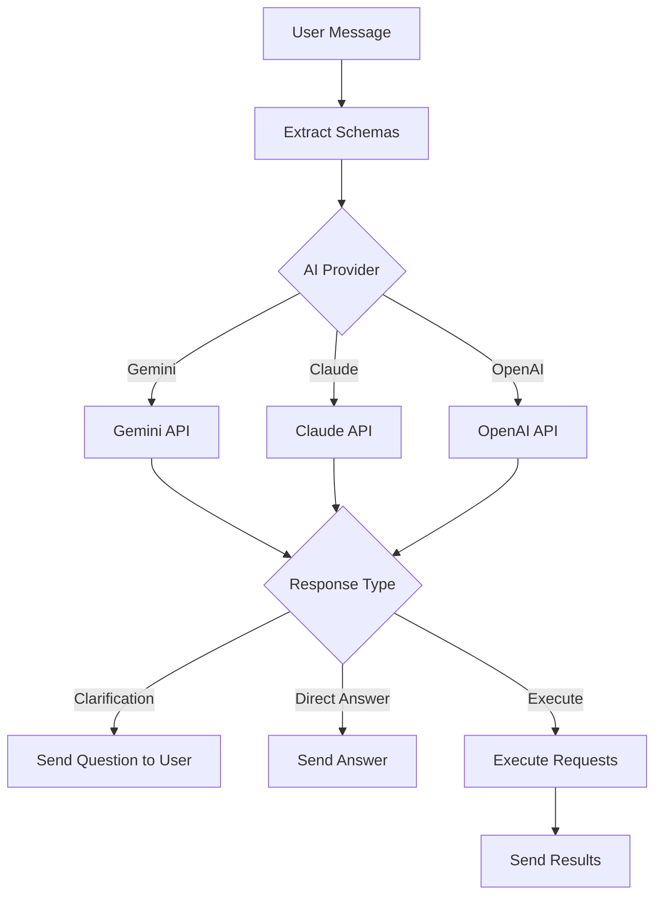

# Phase 3 Completion: AI Provider Integration  & WebSocket

## Summary

Successfully implemented AI provider abstraction layer with support for multiple AI models (Gemini, Claude, OpenAI) and integrated with the existing WebSocket infrastructure for real-time conversational AI chat.

---

## What Was Built

### AI Provider Core

#### 1. **AIProvider Interface** ([AIProvider.java](file:///Users/kalaimaran.m/Documents/DataNexus/data-nexus/src/main/java/com/datanexus/datanexus/service/ai/provider/AIProvider.java))

```java
public interface AIProvider {
    String getName();
    AIResponse chat(AIRequest request);
    boolean supportsClarification();
    boolean isConfigured();
}
```

All providers implement this unified interface for consistency.

---

#### 2. **Request/Response Models**

**[AIRequest](file:///Users/kalaimaran.m/Documents/DataNexus/data-nexus/src/main/java/com/datanexus/datanexus/service/ai/provider/AIRequest.java):**
```java
{
    String userMessage;
    List<SourceSchema> availableSchemas;  // All data sources
    List<Message> conversationHistory;
    Map<String, Object> preferences;
}
```

**[AIResponse](file:///Users/kalaimaran.m/Documents/DataNexus/data-nexus/src/main/java/com/datanexus/datanexus/service/ai/provider/AIResponse.java):**
```java
{
    AIResponseType type;  // CLARIFICATION_NEEDED, READY_TO_EXECUTE, DIRECT_ANSWER
    String content;
    List<DataRequest> dataRequests;  // SQL queries, MCP calls
    String clarificationQuestion;
    List<String> suggestedOptions;
    String intent;
}
```

---

### AI Provider Implementations

#### 3. **GeminiProvider** ([GeminiProvider.java](file:///Users/kalaimaran.m/Documents/DataNexus/data-nexus/src/main/java/com/datanexus/datanexus/service/ai/provider/GeminiProvider.java))

✅ Full implementation with:
- Google Generative AI API integration
- JSON-structured prompts with schema formatting
- Support for SQL and MCP request generation
- Clarification flow support
- Configurable model (`gemini-2.0-flash-exp`)

**Example prompt structure:**
```
You are a data analyst assistant with access to multiple data sources.

User Question: Show me sales from last month

Available Data Sources:
- Database: PostgreSQL (sales_db)
  Tables:
    - orders (id:bigint, amount:decimal, date:timestamp)
    - customers (id:bigint, name:varchar, email:varchar)
- MCP Server: Analytics Server
  Tools:
    - get_metrics: Get analytics metrics
  Resources:
    - sales_reports: Monthly sales reports

Return JSON: { "type": ..., "dataRequests": [...] }
```

---

#### 4. **ClaudeProvider** ([ClaudeProvider.java](file:///Users/kalaimaran.m/Documents/DataNexus/data-nexus/src/main/java/com/datanexus/datanexus/service/ai/provider/ClaudeProvider.java))

✅ Anthropic Claude integration:
- Claude 3.5 Sonnet API
- Same prompt structure as Gemini
- JSON response parsing
- Clarification support

**Configuration:**
```yaml
ai:
  claude:
    api-key: ${CLAUDE_API_KEY}
    model: claude-3-5-sonnet-20241022
```

---

#### 5. **OpenAIProvider** ([OpenAIProvider.java](file:///Users/kalaimaran.m/Documents/DataNexus/data-nexus/src/main/java/com/datanexus/datanexus/service/ai/provider/OpenAIProvider.java))

⚠️ Placeholder implementation (to be completed when refactoring existing `QueryGeneratorService`)

---

#### 6. **AIProviderFactory** ([AIProviderFactory.java](file:///Users/kalaimaran.m/Documents/DataNexus/data-nexus/src/main/java/com/datanexus/datanexus/service/ai/provider/AIProviderFactory.java))

Provider selection and management:

```java
// Get by name
AIProvider provider = factory.getProvider("gemini");

// Get default (first configured)
AIProvider provider = factory.getDefaultProvider();

// List available
List<String> providers = factory.getAvailableProviders();
// Returns: ["gemini", "claude"] (if both configured)
```

---

### Multi-Source Orchestrator

#### 7. **MultiSourceChatOrchestrator** ([MultiSourceChatOrchestrator.java](file:///Users/kalaimaran.m/Documents/DataNexus/data-nexus/src/main/java/com/datanexus/datanexus/service/ai/MultiSourceChatOrchestrator.java))

New orchestrator supporting multi-source + AI providers:

**Workflow:**


**Key features:**
- Multi-source schema extraction (databases + MCP)
- AI provider selection via request
- Clarification flow handling
- Unified execution across sources
- WebSocket progress updates

---

### WebSocket Integration

#### 8. **Updated AnalyzeRequest** ([AnalyzeRequest.java](file:///Users/kalaimaran.m/Documents/DataNexus/data-nexus/src/main/java/com/datanexus/datanexus/dto/websocket/AnalyzeRequest.java))

Extended with AI provider support:

```java
{
    String userMessage;
    Long conversationId;
    List<Long> connectionIds;  // Unified: databases + MCP
    
    // NEW fields
    String aiProvider;  // "gemini", "claude", "openai"
    boolean isClarificationResponse;
    String clarificationAnswer;
}
```

---

#### 9. **ClarificationRequest** ([ClarificationRequest.java](file:///Users/kalaimaran.m/Documents/DataNexus/data-nexus/src/main/java/com/datanexus/datanexus/dto/websocket/ClarificationRequest.java))

New DTO for AI → User clarification:

```java
{
    Long conversationId;
    String question;
    List<String> suggestedOptions;  // Optional multiple choice
    Instant timestamp;
}
```

**WebSocket queue:** `/queue/ai/clarification`

---

#### 10. **Updated WebSocket Controller** ([AIAnalystWebSocketController.java](file:///Users/kalaimaran.m/Documents/DataNexus/data-nexus/src/main/java/com/datanexus/datanexus/controller/AIAnalystWebSocketController.java))

Smart routing between old and new orchestrators:

```java
@MessageMapping("/ai/analyze")
public void analyzeData(@Payload AnalyzeRequest request, ...) {
    // Route based on AI provider field
    if (request.getAiProvider() != null && !request.getAiProvider().isEmpty()) {
        // NEW: Multi-source with AI provider
        multiSourceOrchestrator.processMessage(request, user, wsUser);
    } else {
        // LEGACY: Original orchestrator
        orchestrator.processAnalyzeRequest(request, user, wsUser);
    }
}
```

**Backward compatibility:** Clients without `aiProvider` field use legacy flow.

---

## Usage Examples

### Frontend Request (With AI Provider)

```javascript
// Connect to WebSocket
stompClient.send("/app/ai/analyze", {}, JSON.stringify({
    userMessage: "Show me top 10 customers by revenue",
    conversationId: 123,
    connectionIds: [1, 2],  // DB connection 1, MCP connection 2
    aiProvider: "gemini"
}));

// Listen for clarification
stompClient.subscribe("/user/queue/ai/clarification", (message) => {
    const clarification = JSON.parse(message.body);
    console.log(clarification.question);
    console.log(clarification.suggestedOptions);
    
    // User responds
    stompClient.send("/app/ai/analyze", {}, JSON.stringify({
        userMessage: "",
        conversationId: 123,
        connectionIds: [1, 2],
        aiProvider: "gemini",
        isClarificationResponse: true,
        clarificationAnswer: "Last 30 days"
    }));
});

// Listen for final response
stompClient.subscribe("/user/queue/ai/response", (message) => {
    const response = JSON.parse(message.body);
    console.log(response.summary);
    console.log(response.queryResults);
});
```

---

## WebSocket Queues

| Queue | Purpose | Example Message |
|-------|---------|----------------|
| `/queue/ai/activity` | Progress updates | `{phase: "EXECUTING_QUERIES", status: "in_progress"}` |
| `/queue/ai/clarification` | AI asks question | `{question: "Which time period?", options: [...]}` |
| `/queue/ai/response` | Final answer | `{success: true, summary: "...", queryResults: [...]}` |
| `/queue/ai/error` | Error notifications | `{code: "NO_SCHEMAS", message: "..."}` |

---

## Configuration

### application.yml

```yaml
ai:
  # Gemini
  gemini:
    api-key: ${GEMINI_API_KEY:}
    model: gemini-2.0-flash-exp
    
  # Claude  
  claude:
    api-key: ${CLAUDE_API_KEY:}
    model: claude-3-5-sonnet-20241022
    
  # OpenAI
  openai:
    api-key: ${OPENAI_API_KEY:}
    model: gpt-4o-mini
```

---

## Multi-Source Example

**User:** "Compare sales from database with analytics from MCP server"

**System:**
1. Extracts schemas from both data sources
2. Sends to Gemini with combined schema
3. Gemini generates:
   - SQL query for database
   - MCP tool call for analytics server
4. Executes both in parallel
5. Returns unified results

**AI Response:**
```json
{
  "type": "READY_TO_EXECUTE",
  "content": "I'll fetch sales from your database and analytics from the MCP server",
  "dataRequests": [
    {
      "requestType": "SQL_QUERY",
      "sql": "SELECT SUM(amount) as total_sales FROM orders WHERE date >= '2026-01-01'",
      "explanation": "Get total sales from database"
    },
    {
      "requestType": "MCP_TOOL_CALL",
      "toolName": "get_metrics",
      "arguments": {"metric": "sales", "period": "month"},
      "explanation": "Get sales metrics from analytics server"
    }
  ]
}
```

---

## Key Achievements ✅

- Unified AI provider interface
- Gemini & Claude fully integrated
- Multi-source schema handling
- Clarification conversation flow
- WebSocket routing with backward compatibility
- Clean separation between legacy and new systems

---

## Next Steps

**Phase 4 & 5:** Complete conversation context tracking and unified execution layer for actual data request processing.
