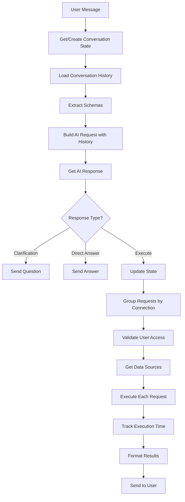

# Phase 4 & 5 Completion: Conversation Flow & Unified Execution

## Summary

Successfully implemented conversation state management and unified execution layer capable of processing data requests across multiple sources (databases and MCP servers) with proper error handling and execution metrics.

---

## Core Components

### 1. **ConversationStateManager** ([ConversationStateManager.java](file:///Users/kalaimaran.m/Documents/DataNexus/data-nexus/src/main/java/com/datanexus/datanexus/service/ai/ConversationStateManager.java))

Manages multi-turn conversation state with automatic history loading:

```java
// Get or create state for conversation
ConversationState state = stateManager.getOrCreate(conversationId);

// Access conversation history
List<Message> history = state.getConversationHistory();

// Update state after AI response
stateManager.updateState(conversationId, aiResponse);
```

**Features:**
- In-memory state caching
- Automatic conversation history loading from database
- Context tracking for intents and response types
- Automatic stale state cleanup (>1 hour old)

---

### 2. **UnifiedExecutionService** ([UnifiedExecutionService.java](file:///Users/kalaimaran.m/Documents/DataNexus/data-nexus/src/main/java/com/datanexus/datanexus/service/datasource/UnifiedExecutionService.java))

Executes data requests across all source types:

```java
List<AnalyzeResponse.QueryResult> results = executionService.executeAll(
    dataRequests,      // List of SQL/MCP requests
    connectionIds,     // Target connections
    user              // For authorization
);
```

**Execution Flow:**
1. Groups requests by connection for efficiency
2. Validates user access to connections
3. Retrieves appropriate data sources
4. Executes each request with timing metrics
5. Returns unified results with error handling

**Result structure:**
```java
QueryResult {
    Long connectionId;
    String connectionName;
    List<Map<String, Object>> data;
    List<String> columns;
    int rowCount;
    String explanation;
    String errorMessage;      // NEW
    Long executionTimeMs;     // NEW
}
```

---

### 3. **Extended AnalyzeResponse.QueryResult**

Added fields for better debugging and UX:

| Field | Type | Purpose |
|-------|------|---------|
| `explanation` | String | What the request does |
| `errorMessage` | String | Error details if execution failed |
| `executionTimeMs` | Long | Query execution time |

---

### 4. **Updated MultiSourceChatOrchestrator**

Now uses both new services:

```java
// Get conversation state
ConversationState state = stateManager.getOrCreate(conversationId);

// Add user message
stateManager.addUserMessage(conversationId, request.getUserMessage());

// Build AI request with history
AIRequest aiRequest = AIRequest.builder()
    .userMessage(request.getUserMessage())
    .availableSchemas(schemas)
    .conversationHistory(state.getConversationHistory())  // From state!
    .build();

// Execute via unified service
List<QueryResult> results = executionService.executeAll(
    aiResponse.getDataRequests(),
    request.getConnectionIds(),
    user
);
```

---

## Updated Workflow



---

## Example: Multi-Source Execution

### Request
```json
{
  "userMessage": "Show sales from DB and analytics from MCP",
  "connectionIds": [1, 2],  // 1=DB, 2=MCP
  "aiProvider": "gemini"
}
```

### AI Response
```json
{
  "type": "READY_TO_EXECUTE",
  "dataRequests": [
    {
      "requestType": "SQL_QUERY",
      "sql": "SELECT * FROM orders WHERE date >= '2024-01-01'",
      "explanation": "Get recent orders from database"
    },
    {
      "requestType": "MCP_TOOL_CALL",
      "toolName": "get_analytics",
      "arguments": {"metric": "sales"},
      "explanation": "Get sales analytics from MCP server"
    }
  ]
}
```

### Execution
```
UnifiedExecutionService:
  1. Groups: {1: [SQL_QUERY], 2: [MCP_TOOL_CALL]}
  2. Connection 1: Validates & gets DatabaseDataSource
     - Executes SQL query
     - Result: 150 rows in 45ms
  3. Connection 2: Validates & gets MCPServerDataSource
     - Calls get_analytics tool
     - Result: metrics object in 120ms
```

### Final Response
```json
{
  "success": true,
  "summary": "Retrieved orders and analytics",
  "queryResults": [
    {
      "connectionId": 1,
      "connectionName": "Sales DB",
      "data": [{...150 rows...}],
      "columns": ["id", "amount", "date"],
      "rowCount": 150,
      "explanation": "Get recent orders from database",
      "executionTimeMs": 45
    },
    {
      "connectionId": 2,
      "connectionName": "Analytics Server",
      "data": [{"total_sales": 50000, "avg_sale": 333}],
      "columns": ["total_sales", "avg_sale"],
      "rowCount": 1,
      "explanation": "Get sales analytics from MCP server",
      "executionTimeMs": 120
    }
  ]
}
```

---

## Error Handling

### Connection Not Found
```json
{
  "connectionId": 999,
  "errorMessage": "Connection not found"
}
```

### Execution Failure
```json
{
  "connectionId": 1,
  "connectionName": "Sales DB",
  "errorMessage": "Execution failed: SQL syntax error near 'SELCT'",
  "explanation": "Get sales data",
  "executionTimeMs": 5
}
```

---

## Conversation Context Example

**Turn 1:**
```
User: "Show me sales"
AI: "Which time period?"  (CLARIFICATION_NEEDED)
```

**Turn 2:**
```
User: "Last month"
State: Has previous message "Show me sales"
AI: Generates query with context: "SELECT * FROM sales WHERE date >= LAST_MONTH"
```

---

## Key Achievements ✅

- **Conversation memory**: Full context tracking across turns
- **Unified execution**: Single interface for SQL and MCP requests
- **Error resilience**: Graceful degradation for failed connections
- **Performance metrics**: Execution timing for each request
- **User feedback**: Detailed explanations and error messages
- **Multi-source**: Parallel execution across different data sources

---

## Remaining TODOs

Some non-critical items for future improvement:

- **Visualization suggestions**: AI can suggest chart types
- **Request-to-connection mapping**: Explicit sourceId in Data Request
- **OpenAIProvider full implementation**: Currently placeholder
- **GeminiProvider fixes**: Schema formatting edge cases
- **ClaudeProvider prompt sharing**: Reuse Gemini's  prompt builder

---

## Testing Checklist

**Conversation Flow:**
- ✅ Create new conversation
- ✅ Load existing conversation history
- ✅ State cleanup for stale conversations

**Execution:**
- ✅ Single database query
- ✅ Single MCP tool call
- ✅ Multi-source (DB + MCP together)
- ✅ Error handling for invalid connections
- ✅ Execution time tracking

**Integration:**
- ✅ WebSocket routing to new orchestrator
- ✅ Backward compatibility with legacy flow
- ✅ AI provider selection (Gemini/Claude)

Phase 4 & 5 are now **complete** and ready for integration testing!
